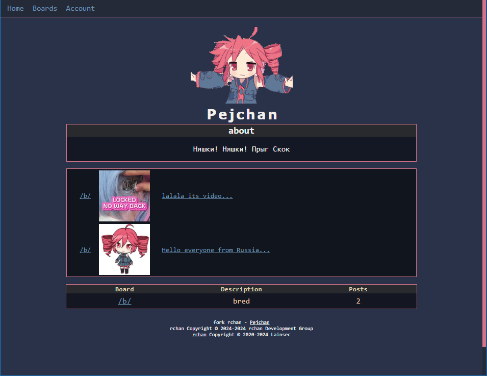
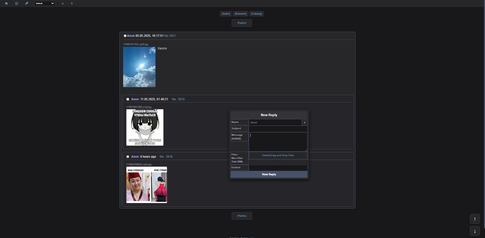

# Pejchan

This imageboad is an improvement of [rchan](https://github.com/lainsec/rchan)
Added thumbnails, support for mp3 files, improved form for sending posts, design changes
Сonvenient viewing of media files, improved statistics, bug fixes, many other minor improvements




## How to install

It is assumed that you have already installed python3.11

```bash
1. git clone https://github.com/motorist828/Pejchan
2. cd Pejchan
3. python3 -m venv venv
4. source venv/bin/activate
5. pip install -r requirements.txt
```
for windows
go to the Pejchan folder, open powershell in it and run the commands

```bash
python -m venv venv
.\venv\Scripts\activate.bat
pip install -r requirements.txt
```

## How to use
```bash
 python3 app.py or python app.py depending on your OS
`The first account will automatically get OWNER permissions. 
 Use a long enough password when registering.
 You can change the name in the templates\index.html file. Line #21
 About - /templates/utils/index-about-container.html`
```
# Features
- [x] Free creation of boards for all users.
- [x] lightweight source code.
- [x] Real-time posts with websocket.
- [x] Responsive style for mobile.
- [x] Tripcode system with SHA256.
- [x] Board pagination.
- [x] Multi language support. 🇯🇵 🇧🇷 🇺🇸 🇪🇸
- [x] Encrypted passwords with SHA256.
- [x] Anti-spam with internal captcha and timeout system.

# License
GNU AGPLv3, see [LICENSE](https://github.com/lainsec/rchan/blob/master/LICENSE)

