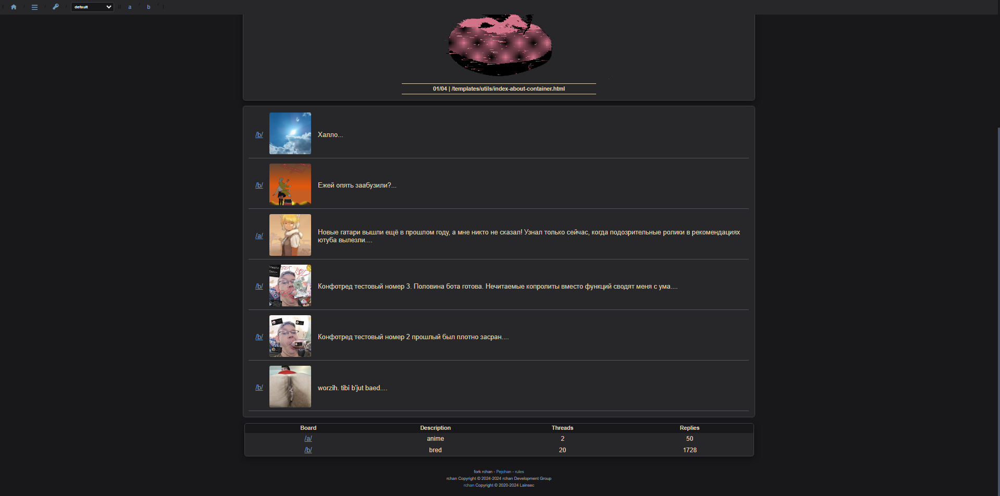

# Pejchan

This imageboad is an improvement of [rchan](https://github.com/lainsec/rchan)
Database changed to SQLite, thumbnails added, mp3 support, improved message form, design changes, redesigned admin panel
Convenient viewing of media files, improved statistics, bug fixes, many other small improvements




The rest of the screenshots are in the img folder

## How to install

It is assumed that you have already installed python3.11

```bash
1. git clone https://github.com/motorist828/Pejchan
2. cd Pejchan
3. python3 -m venv venv
4. source venv/bin/activate
5. pip install -r requirements.txt
```
for windows
go to the Pejchan folder, open powershell in it and run the commands

```bash
python -m venv venv
.\venv\Scripts\activate.bat
pip install -r requirements.txt
```

## How to use
```bash
 run database_setup.py once
 run app.py 
 The password and administrator name are set in the database_setup.py file.. 
 Also change the passcode in the posts_bp.py file line 465
 About - /templates/utils/index-about-container.html`
```
# Features
- [x] Free creation of boards for all users.
- [x] lightweight source code.
- [x] Real-time posts with websocket.
- [x] Responsive style for mobile.
- [x] Tripcode system with SHA256.
- [x] Board pagination.
- [x] Multi language support. 🇯🇵 🇧🇷 🇺🇸 🇪🇸
- [x] Encrypted passwords with SHA256.
- [x] Anti-spam with internal captcha and timeout system.

# License
GNU AGPLv3, see [LICENSE](https://github.com/lainsec/rchan/blob/master/LICENSE)

